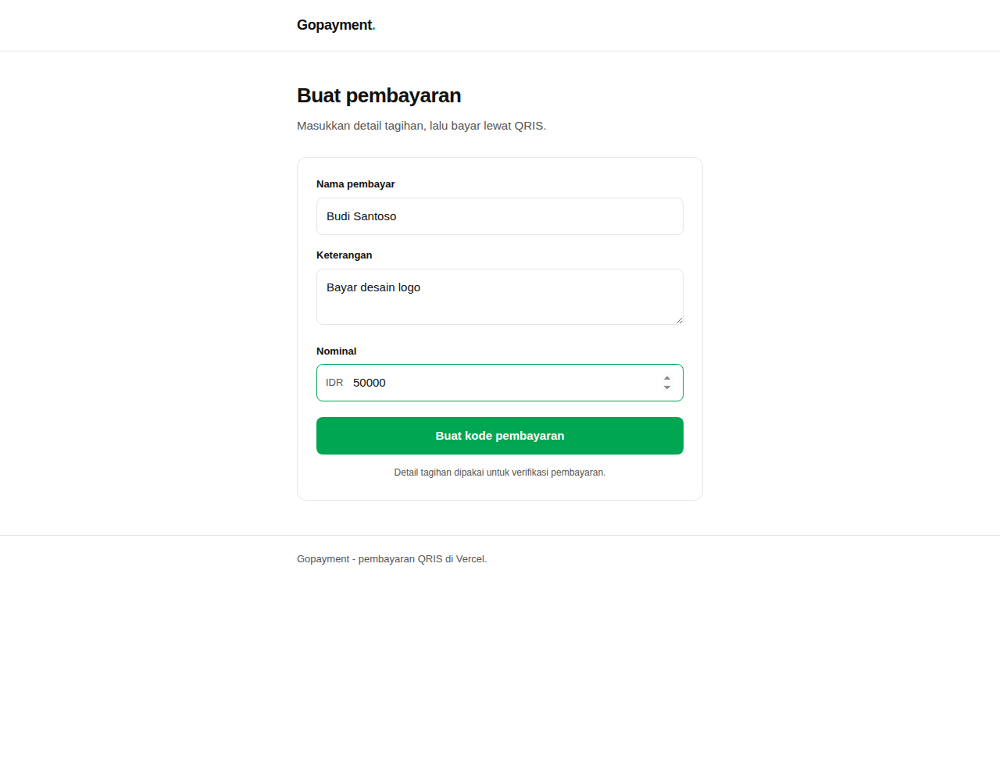

# Gopayment Vercel

Infrastruktur payment gateway QRIS yang jalan di Vercel Serverless Functions. Repo ini versi publik dari gateway pembayaran, berisi logika inti tanpa kredensial asli. Semua rahasia disimpan di environment variables, bukan di kode.

## Preview



Halaman pembayaran: isi nama, keterangan, nominal, lalu QRIS muncul otomatis.

## Fitur

- Buat sesi pembayaran dengan QRIS dinamis dari string QRIS statis merchant
- Pajak unik otomatis (Rp 1-100) supaya pencocokan pembayaran akurat
- Cek pembayaran dengan polling ke API GoBiz
- Notifikasi Discord webhook saat pembayaran masuk
- Endpoint gateway ber-API key untuk integrasi dari aplikasi lain
- Session tersimpan di Upstash Redis (tidak hilang antar request)
- Zero-framework, cuma handler Vercel biasa

## Struktur

```
.
├── api/
│   ├── create-payment.js       # POST: buat sesi + QRIS dinamis
│   ├── check-payment.js        # POST: cek pembayaran (login GoBiz, cocokkan nominal)
│   ├── gateway.js              # endpoint gateway: create/status/payment (butuh API key)
│   ├── status/
│   │   └── [sessionId].js      # GET: lihat status sesi
│   ├── _store.js               # store: Upstash Redis, fallback ke memori
│   ├── _gateway.js             # logika gateway: rate limit, auth, callback
│   ├── _gobiz.js               # client GoBiz (login + riwayat transaksi)
│   └── _debug_webhook.js       # log request ke Discord (opsional)
├── public/
│   ├── index.html              # halaman pembayaran (form + QRIS + polling status)
│   └── preview.png             # screenshot hasil render halaman pembayaran
├── vercel.json                 # routing, security headers, fungsi config
├── package.json
└── .env.example                # daftar semua env yang dibutuhkan
```

## Alur pembayaran

1. Client panggil `POST /api/create-payment` dengan `nama`, `tentang`, `nominal`.
2. Server generate QRIS dinamis: string statis + nominal + pajak unik (1-100).
3. Client tampilkan QRIS, buyer scan dan bayar lewat aplikasi bank.
4. Client polling `POST /api/check-payment` tiap beberapa detik.
5. Server login GoBiz, tarik riwayat, cari nominal yang cocok.
6. Ketemu -> sesi ditandai sukses, Discord webhook dikirim, callback gateway dipanggil.

## Cara deploy

1. Fork atau clone repo ini.
2. Import ke Vercel (vercel.com/new), pilih repo, biarkan setting default.
3. Isi environment variables. Semua ada di `.env.example`.
4. Deploy.

## Environment Variables

| Variabel | Wajib | Fungsi |
|---|---|---|
| `GOPAY_EMAIL` | ya | Email akun GoBiz merchant |
| `GOPAY_PASSWORD` | ya | Password akun GoBiz merchant |
| `QRIS_STRING` | ya | String QRIS statis merchant (diawali `000201...`) |
| `UPSTASH_REDIS_REST_URL` | ya | URL REST Upstash Redis |
| `UPSTASH_REDIS_REST_TOKEN` | ya | Token REST Upstash Redis |
| `GATEWAY_API_KEY` | untuk gateway | API key endpoint `/api/gateway` |
| `APP_URL` | opsional | URL deploy, untuk link bukti pembayaran |
| `DISCORD_WEBHOOK_URL` | opsional | Notifikasi pembayaran sukses |
| `DEBUG_DISCORD_WEBHOOK_URL` | opsional | Log request ke Discord |

## Cara dapat QRIS_STRING

1. Login ke portal.gofoodmerchant.co.id.
2. Download atau screenshot QRIS statis kamu.
3. Scan gambarnya dengan decoder yang menampilkan raw text (contoh: zxing.org).
4. Copy string panjang mulai dari `000201...` ke env var `QRIS_STRING`.

Perhatian: QRIS statis hanya satu per merchant. `create-payment` mengubahnya jadi QRIS dinamis berisi nominal, dan perhitungan CRC16 disesuaikan otomatis.

## Catatan

- Repo ini versi infrastruktur. Kredensial asli tidak pernah ada di dalam kode, cukup di env.
- Tanpa Redis, session hanya hidup di memori instance serverless, jadi untuk dipakai sungguhan wajib pakai Upstash.
- `check-payment` login ke GoBiz setiap request. Ada cache token di level modul, tapi cold start akan login ulang.
- Rate limit gateway: create 20/menit, status 120/menit per API key atau IP.

## Lisensi

MIT